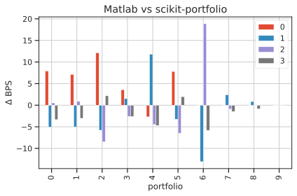

# MAD: Mean Absolute Deviation portfolio

The portfolio estimators in the efficient MAD frontier implement what is known as mean-absolute deviation portfolio optimization (Konno and Yamazaki, 1993 [^1] ), which is generally referred to as MAD portfolio optimization.
MAD portfolio optimization works with the same return proxies and portfolio sets as mean-variance portfolio optimization but uses **mean-absolute deviation** or **L1-risk** as the risk proxy, rather than portfolio volatility $\sqrt{\mathbf{w}^T\mathbf{C}\mathbf{w}}$.

The **L1-risk model** involves no quadratic forms, hence it does not scale quadratically with the number of assets, but rather it scales linearly with the number of historical samples. It can be expressed as the average of the excess returns weighted by $\mathbf{w}$, as follows:

\begin{equation}
\textrm{L1 risk} = \mathbb{E} \left \lbrack \left\| (\mathbf{R}  - \boldsymbol \mu)^T \mathbf{w} \right\| \right\rbrack = \frac{1}{T} \sum_{t=1}^T \sum_{i=1}^N \bigl\| (R_{t,i} - \mu_i) w_i \bigr\|
\end{equation}
where $\mathbf{R} \in \mathbb{R}^{T \times N}$ is the asset returns matrix of $N$ assets over $T$ historical samples, and $\boldsymbol \mu$ are the *expected returns*.

In more general terms, the optimization problem solved by the MAD portfolio in the standard settings is the following:

\begin{split}\begin{equation}
\begin{aligned}
\underset{\mathbf{w}}{\text{minimize}} & &  \mathbb{E} \left \lbrack \left| (\mathbf{R}  - \boldsymbol \mu)^T \mathbf{w} \right| \right\rbrack \\
\text{subject to} & & \mathbf{w}^T \boldsymbol \mu \geq r^\star \\
& & \mathbf{w}^T \mathbf{1} = 1\\
& & w_{\textrm{min}} \leq w_i \leq w_{\textrm{max}}
\end{aligned}
\end{equation}\end{split}

The above problem is linear, and can be implemented in any linear solver.
The main advantage of MAD over the classical Markowitz frontier is that, being linear, it exhibits less dependency on small fluctuations of the expected returns.

The MAD model is in fact used to solve huge portfolio optimization models including the internationally diversified investment model, the long-term asset liability management (ALM) model and the mortgage-backed security portfolio optimization model. 
It was recently shown that the MAD model possess several advantageous theoretical properties. In particular, all capital asset pricing model (CAPM)-type relations for the mean-variance model also hold for the MAD model.
Furthermore, the MAD model is more compatible with the fundamental principle of rational decision-making[^2].


!!! note
	
     
	In this picture above we show the efficient frontier for the MAD portfolio.     
	On the x-axis the $L1$ risk measure, on the $y$-axis the portfolio return. 
	The <span style="color:purple">purple lines</span> indicate the efficient risk portfolio 🟣.
	The solid line is the target risk $\approx 0.035$  with the resulting return of $\approx 0.09$.
	The <span style="color:darkgreen">green lines</span> indicate the efficient return portfolio 🟢.
	The solid line is the target return $\approx 0.011$ with the resulting risk of $\approx 0.05$.
	The black dot ⚫️indicates the asset with the highest return and highest risk. 
	The <span style="text-color:red">red</span> dot 🔴️ indicates the minimum MAD portfolio.

## Minimum MAD Portfolio [📖](../efficient_mad_api/#minimum-mad-portfolio-minimummad)

It calculates the portfolio minimizing the above L1-risk model, with the weight constraints.

The optimization problem is the following:

\begin{split}\begin{equation*}
\begin{aligned}
& \underset{\mathbf{w}}{\text{minimize}} & & \mathbb{E} \left \lbrack \left| (\mathbf{R}  - \boldsymbol \mu)^T \mathbf{w} \right| \right\rbrack \\
& \text{subject to} & & \mathbf{w}^T \mathbf{1} = 1\\
& & & w_{\textrm{min}} \leq w_i \leq w_{\textrm{max}}
\end{aligned}
\end{equation*}\end{split}

<hr>

## Efficient return optimization on MAD frontier [📖](../efficient_mad_api//#efficient-return-optimization-on-mad-frontier)

It calculates the MAD efficient return portfolio, by minimizing the above L1-risk model, subject to a minimum portfolio return above the target return.
The optimization problem is the following:

\begin{split}\begin{equation*}
\begin{aligned}
& \underset{\mathbf{w}}{\text{minimize}} & & \mathbb{E} \left \lbrack \left| (\mathbf{R}  - \boldsymbol \mu)^T \mathbf{w} \right| \right\rbrack \\
& \text{subject to} & & \mathbf{w}^T \boldsymbol \mu \geq r^\star \\
&&& \mathbf{w}^T \mathbf{1} = 1\\
&&& w_{\textrm{min}} \leq w_i \leq w_{\textrm{max}}
\end{aligned}
\end{equation*}\end{split}

<hr>

## Efficient risk optimization on MAD frontier [📖](../efficient_mad_api//#efficient-risk-optimization-on-mad-frontier)

It calculates the MAD efficient risk portfolio, by maximizing the portfolio return, subject to a L1-risk above the target risk. The optimization problem is the following:

\begin{split}\begin{equation*}
\begin{aligned}
& \underset{\mathbf{w}}{\text{maximize}} & & \mathbf{w}^T \boldsymbol \mu \\
& \text{subject to} & &  \mathbb{E} \left \lbrack \left| (\mathbf{R}  - \boldsymbol \mu)^T \mathbf{w} \right| \right\rbrack \leq r^\star \\
&&& \mathbf{w}^T \mathbf{1} = 1\\
&&& w_{\textrm{min}} \leq w_i \leq w_{\textrm{max}}
\end{aligned}
\end{equation*}\end{split}

<hr>

# Comparison of results with MATLAB™ `PortfolioMAD` class.
You can compare the construction of the efficient frontier of the MAD portfolio in `scikit-portfolio` with the ones obtained with an expensive commercial software like Matlab.
Here we check that the results are the same up to a ***very small*** rounding error.
This is likely caused  by slight differences between the ECOS solver in `scikit-portfolio` and the internal `linprog` solver by MATLAB.

!!! warning
	To reproduce this result you need the Matlab Financial Toolbox. This example has been run on Matlab 2021b.

```matlab
m = [ 0.05; 0.1; 0.12; 0.18 ];
C = [ 0.0064 0.00408 0.00192 0; 
    0.00408 0.0289 0.0204 0.0119;
    0.00192 0.0204 0.0576 0.0336;
    0 0.0119 0.0336 0.1225 ];
m = m/12;
C = C/12;

AssetScenarios = mvnrnd(m, C, 20000);
NumPortfolios = 10
% the output of estimateFrontier is a 10 assets x 4 portfolio weights
weights = estimateFrontier(setDefaultConstraints(PortfolioMAD('AssetScenarios',AssetScenarios)),NumPortfolios)
weights'
```

The result are the following weights, a 10 by 4 matrix, whose rows sum to 1, with the first row representing the minimum MAD portfolio, and the last row the riskiest portfolio composed by a single asset.

```markdown
ans =

    0.8924    0.0365    0.0374    0.0337
    0.7235    0.1323    0.0413    0.1029
    0.5571    0.2263    0.0427    0.1739
    0.3903    0.3205    0.0447    0.2445
    0.2207    0.4184    0.0473    0.3136
    0.0534    0.5074    0.0566    0.3827
         0    0.4406    0.0437    0.5157
         0    0.3076    0.0123    0.6801
         0    0.1588         0    0.8412
         0         0         0    1.0000
```

Now verify the results by manually reconstructing the frontier by returns with `scikit-portfolio`.
It is very easy to generate the efficient frontier together with its weights with the `.estimate_frontier` method

```python
import  numpy as np
# here the same parameters as those from MATLAB example
m = np.array([ 0.05,  0.1,  0.12,  0.18 ])
C = np.array([[ 0.0064, 0.00408, 0.00192, 0,], [0.00408, 0.0289, 0.0204, 0.0119], [0.00192, 0.0204, 0.0576, 0.0336], [0, 0.0119, 0.0336, 0.1225,]])
m = m/12
C = C/12
r = np.random.multivariate_normal(mean=m,cov=C, size=20000)
from skportfolio import MinimumMAD
MinimumMAD(returns_data=True).set_n_jobs(-1).estimate_frontier(r)[2]
```

<table border="1" class="dataframe">
  <thead>
    <tr style="text-align: right;">
      <th>portfolio</th>
      <th>A</th>
      <th>B</th>
      <th>C</th>
      <th>D</th>
    </tr>
  </thead>
  <tbody>
    <tr>
      <th>0</th>
      <td>0.8916</td>
      <td>0.0370</td>
      <td>0.0373</td>
      <td>0.0340</td>
    </tr>
    <tr>
      <th>1</th>
      <td>0.7229</td>
      <td>0.1328</td>
      <td>0.0411</td>
      <td>0.1032</td>
    </tr>
    <tr>
      <th>2</th>
      <td>0.5560</td>
      <td>0.2268</td>
      <td>0.0436</td>
      <td>0.1736</td>
    </tr>
    <tr>
      <th>3</th>
      <td>0.3899</td>
      <td>0.3203</td>
      <td>0.0450</td>
      <td>0.2447</td>
    </tr>
    <tr>
      <th>4</th>
      <td>0.2210</td>
      <td>0.4172</td>
      <td>0.0477</td>
      <td>0.3141</td>
    </tr>
    <tr>
      <th>5</th>
      <td>0.0526</td>
      <td>0.5077</td>
      <td>0.0572</td>
      <td>0.3825</td>
    </tr>
    <tr>
      <th>6</th>
      <td>0.0000</td>
      <td>0.4419</td>
      <td>0.0418</td>
      <td>0.5163</td>
    </tr>
    <tr>
      <th>7</th>
      <td>0.0000</td>
      <td>0.3074</td>
      <td>0.0124</td>
      <td>0.6803</td>
    </tr>
    <tr>
      <th>8</th>
      <td>0.0000</td>
      <td>0.1588</td>
      <td>0.0000</td>
      <td>0.8412</td>
    </tr>
    <tr>
      <th>9</th>
      <td>0.0000</td>
      <td>0.0000</td>
      <td>0.0000</td>
      <td>1.0000</td>
    </tr>
  </tbody>
</table>


The resulting output is shown above following, and it only takes 4 seconds!
Given the large number of samples ($T=20,000$) we converge to the same result as from MATLAB, but **twice as fast**!


For completeness here we also report the entire self-explaining code for the generation of 10 points along the efficient frontier.


```python
import numpy as np
import pandas as pd
from skportfolio.frontier._mad import EfficientMeanAbsoluteDeviation
from warnings import warn
# here the same parameters as those from MATLAB example
m = np.array([ 0.05,  0.1,  0.12,  0.18 ])
C = np.array([[ 0.0064, 0.00408, 0.00192, 0,], [0.00408, 0.0289, 0.0204, 0.0119], [0.00192, 0.0204, 0.0576, 0.0336], [0, 0.0119, 0.0336, 0.1225,]])
m = m/12
C = C/12
r = np.random.multivariate_normal(mean=m,cov=C, size=20000)
# creates a well-formed dataframe
returns = pd.DataFrame(r, columns=['A','B','C','D'])
mu = returns.mean()
# minimum risk portfolio, frontier starts here
w_min = pd.Series(
    EfficientMeanAbsoluteDeviation(
        expected_returns=mu,
        returns=returns
    ).min_risk(),
    index=returns.columns
)
NumPortfolios = 10
# minimum MAD risk proxy 
min_risk = np.mean(np.abs(w_min@(returns - mu).T))
# minimum portfolio return of the corresponding weight
min_ret = w_min.T @ mu
# compute frontier from efficient returns
# the 1E-6 is needed to help converge nicely to the highest risk portfolio
rets = np.linspace(min_ret, np.max(mu)-1E-6, NumPortfolios)
risks = np.array([np.nan]*NumPortfolios)
all_weights = []
for i,r in enumerate(rets):
    try:
        MAD = EfficientMeanAbsoluteDeviation(
            expected_returns=mu,
            returns=returns
        )
        weights = pd.Series(
            MAD.efficient_return(target_return=r),
            index=returns.columns
        )
        risks[i] = np.mean(np.abs(weights@(returns-mu).T))
        all_weights.append(weights)
    except Exception as ex:
        warn(str(ex)) ## in case some solver error is raised, we simply print a warning

risks = np.array(risks)
all_weights = np.array(all_weights)
all_weights.round(4)
```

It is great to see that `scikit-portfolio` results are highly consistent with those from Matlab's  🎉️🎉️🎉️
```
array([[0.8916, 0.037 , 0.0373, 0.034 ],
       [0.7228, 0.1328, 0.0412, 0.1032],
       [0.5559, 0.2269, 0.0436, 0.1736],
       [0.3899, 0.3204, 0.045 , 0.2447],
       [0.221 , 0.4172, 0.0477, 0.3141],
       [0.0526, 0.5077, 0.0572, 0.3825],
       [0.    , 0.4419, 0.0418, 0.5163],
       [0.    , 0.3074, 0.0124, 0.6803],
       [0.    , 0.1588, 0.    , 0.8412],
       [0.    , 0.    , 0.    , 1.    ]])
```
As you can see the portfolio weights are almost equal among the two systems, certifying the goodness of the `scikit-portfolio` implementation.


!!! note
	
    
	In figure above the difference in basis points (1 BP = 0.01%) between the results of Matlab and results of `EfficientMeanAbsoluteDeviation`. As you can see the two are highly consistent.
	Colors are the assets in the portfolio, named `0,1,2,3`, while on the x-axis each integer represent the portfolio along the efficient frontier, with 0 being the minimum MAD portfolio and 9 the maximum MAD portfolio, hence 
	the one with the maximum risk. The two efficient frontiers are also shown in the figure below:
	

# References
[^1]: Konno, Hiroshi, and Hiroaki Yamazaki. "Mean-absolute deviation portfolio optimization model and its applications to Tokyo stock market." Management science 37.5 (1991): 519-531. [https://pubsonline.informs.org/doi/pdf/10.1287/mnsc.37.5.519](https://pubsonline.informs.org/doi/pdf/10.1287/mnsc.37.5.519)
[^2]: Hiroshi Konno & Tomoyuki Koshizuka (2005) Mean-absolute deviation model, IIE Transactions, 37:10, 893-900, DOI: 10.1080/07408170591007786
[^3]: MATLAB reference manual, for MAD portfolio. [https://it.mathworks.com/help/finance/portfoliomad.html](https://it.mathworks.com/help/finance/portfoliomad.html)