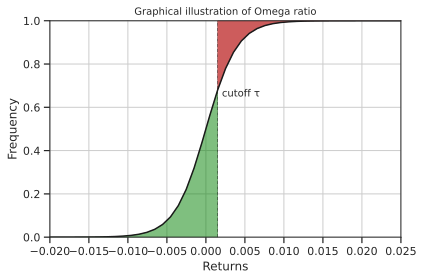
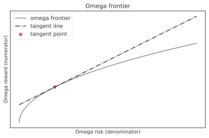

# Omega ratio
A criticism to the classical Sharpe ratio is that it is  only appropriate
when the portfolio return is elliptically distributed, as it only takes into account only first and second moments of 
the returns distribution, neglecting other higher order moments. Especially, when the portfolio return is skewed or
exhibits fat tails, then the Sharpe Ratio might result in counterintuitive performance evaluations and rankings.

To address this issue, **Omega ratio** has been introducede as a measure of the ratio between risk and rewards that 
takes into consideration all moments of the portfolio returns distribution. 
It captures both the downside and upside potential of the constructed portfolio, while remaining consistent with utility maximization. 

The Omega Ratio makes use of a threshold value $\tau$, or *minimum acceptable return* to distinguish the upside from the downside.
This means that portfolio returns above $\tau$ are considered **profits**, whereas returns below $\tau$ are considered as **losses**.

Mathematically, given the cumulative portfolio returns distribution $F(r)$, Omega ratio is defined as: 

\begin{equation}
\Omega(r) = \dfrac{\int_{\tau}^\infty (1-F(r)) dr}{\int_{-\infty}^{\tau} F(r) dr}.
\end{equation}

This concept is well illustrated in the following picture, where the returns cumulative distribution is shown.
Here the Omega Ratio is defined as the ratio of the green area over the red area. The green area on the right of the 
threshold $\tau$ (in this example 0.0015) and above the
cumulative distribution represents the upside potential. 
The red area on the left of the threshold and below the cumulative distribution represents the downside potential (risk):

After some easy manipulation, the Omega ratio can be operationally defined as:

\begin{equation}
\Omega(r_P) = \dfrac{\mathbf{w}^T \boldsymbol \mu - \tau}{\left<  (\tau - \mathbf{w}^T \mathbf{R})^+ \right >} + 1
\end{equation}

In the expression above, at the numerator we have the expected portfolio return, with $\boldsymbol \mu$ being the 
vector of expected returns, while at the denominator we consider the **average** $\left< \cdot \right>$ of the positive 
excess returns, over all temporal samples $t=1,\ldots, T$ with $\mathbf{R}_t$ the return of all assets at time $t$, hence a vector of $N$ assets.
The product $\mathbf{w}^T\mathbf{R}$ is then to be intended as a matrix product between the $N$ dimensional weights 
product and the $N \times T$ dimensional returns matrix.

Similarly to the classical mean-variance frontier, it is possible to draw an efficient frontier also for Omega 
ratio:

The frontier is a direct analogue to the mean-variance efficient frontier, whereas in this case the numerators (**return**) and 
denominator (**volatility**) of the classical Markowitz frontiers are replaced by specific formulas for reward (**Omega numerator**) and risk (**Omega denominator**), operationally defined as:

\begin{split}
\begin{equation*}
\begin{aligned}
\textrm{Omega numerator (reward)} =& \mathbf{w}^T \boldsymbol \mu - \tau \\
\textrm{Omega denominator (risk)} =& \sum_{t=1}^T \max \left( \tau - \mathbf{w}^T \mathbf{R}_t,\, 0 \right )
\end{aligned}
\end{equation*}
\end{split}

The slope of the tangent to the frontier passing through the origin gives the maximum Omega Ratio and indicates
the associated portfolio.
The affiliated Omega Ratio for each point on the frontier is given by the slope of the line passing through it and the origin.
The goal is to find the line with the maximum slope that passes through the origin and a point on the frontier. 
Since the frontier is non-decreasing and concave, the tangent from the origin to the frontier yields the portfolio with the maximum Omega.

Although Omega ratio is a non-convex function, it is possible to express its maximization in terms of a convex 
optimization trasforming the problem into a linear one, because Omega is *quasi-concave* in portfolio weights 
$\mathbf{w}$.

For the set of prices defined in `skportfolio.data.load_tech_stock_prices` the Omega efficient frontier is 
delineated in the following picture:

As in the mean-variance case, the maximum return stock is the one with the maximum risk, as quantified by the Omega 
risk on the x-axis. Similarly to maximum sharpe ratio and minimum volatility, we identify two points on the frontier 
and the tangent line from the origin touches the frontier exactly at maximum omega ratio point.
Small red points are from random uniform portfolios, while the golden dot represents the equally weighted portfolio.

## Maximum Omega ratio
Maximization of the omega ratio is done through linearization of the quasi-convex Omega-ratio problem.
Following a recent paper by Kapsos et al [^1], the mathematical optimization problem to find the maximum Omega ratio 
portfolio in `skportfolio` is the following:

\begin{split}
\begin{equation*}
\begin{aligned}
\underset{\mathbf{s}\in \mathbb{R}^n, \mathbf{q}\in \mathbb{R}^m, z \in \mathbb{R}}{\text{max}} & \mathbf{s}^T 
\boldsymbol \mu - \tau z & \\
& q_t \geq \tau z - \mathbf{s}^T \mathbf{R_t} & \forall t = 1,\ldots,T \\
& q_t \geq 0 & \forall t = 1,\ldots,T \\
& \mathbf{1}^T \mathbf{q} = 1 \\
& \mathbf{1}^T \mathbf{s} = z \\
& z w_{\min} \leq \mathbf{s} \leq z w_{\max} \\
& \mathbf{s}^T \boldsymbol \mu \geq \tau z \\
& z \geq 0
\end{aligned}
\end{equation*}
\end{split}

Once solved, the optimal weights are then recovered from the $\mathbf{s}$ variable after normalization.
The above linear program not only ensures global optimality, but is also simple and fast to solve, even if the 
number of constraints grows linearly with the number of data points (indicated by $T$).

!!! note
	Importantly, here the number of constraints grows linearly with number of temporal samples. 
	The [`EfficientOmegaRatio`](skportfolio) class offers a way to subsample the returns at a predetermined fraction of  the original, thus making the problem
	computationally easier to solve.
	Please refer to the `EfficientOmegaRatio` class documentation, for the `fraction` parameter.

## Minimum Omega Risk
This portfolio minimizes the denominator in the Omega ratio. It is indeed very similar to the objective function of 
the Minimum Absolute Deviation portfolio. The minimum Omega risk optimization problem is solved through the 
`EfficientOmegaFrontier` interface:

\begin{split}
\begin{equation*}
\begin{aligned}
& \underset{\mathbf{w}\in \mathbb{R}^+}{\text{minimize}} & & \left\langle (\tau - \mathbf{w}^T \mathbf{R})^+ 
\right\rangle \\
& \text{subject to} & &  \mathbf{w}^T \mathbf{1} = 1\\
\end{aligned}
\end{equation*}
\end{split}

## Efficient risk on omega-ratio frontier
This portfolio minimizes the denominator in the Omega ratio, conditioned on having a return greater than target 
$\varrho_{\textrm{target}}$.
The following optimization problem is solved through the `EfficientOmegaFrontier` interface via the `.efficient_risk` method:

\begin{split}
\begin{equation*}
\begin{aligned}
& \underset{\mathbf{w}\in \mathbb{R}^+}{\text{minimize}} & & \left\langle (\tau - \mathbf{w}^T \mathbf{R})^+ \right\rangle \\
& \text{subject to} & &  \mathbf{w}^T \mathbf{1} = 1\\
&&&  \mathbf{w}^T \boldsymbol\mu - \tau \geq \varrho_{\textrm{target}}
\end{aligned}
\end{equation*}
\end{split}

## Efficient return on omega-ratio frontier
This portfolio maximizes the numerator of the Omega ratio, conditioned on having a denominator in the Omega ratio greater than target 
$\rho_{\textrm{target}}$.
The following optimization problem is solved through the `EfficientOmegaFrontier` interface via the `efficient_return` method:

\begin{split}
\begin{equation*}
\begin{aligned}
& \underset{\mathbf{w}\in \mathbb{R}^+}{\text{minimize}} & & \mathbf{w}^T \boldsymbol\mu - \tau  \\
& \text{subject to} & &  \mathbf{w}^T \mathbf{1} = 1\\
&&&  \left\langle (\tau - \mathbf{w}^T \mathbf{R})^+ \right\rangle \leq \rho_{\textrm{target}}
\end{aligned}
\end{equation*}
\end{split}

# References

[^1]: "Optimizing the Omega Ratio using Linear Programming", Kapsos M., Zymler S., Christofides N., Rustem B. (2011) [url](https://cs.uwaterloo.ca/~yuying/Courses/CS870_2012/Omega_paper_Short_Cm.pdf):