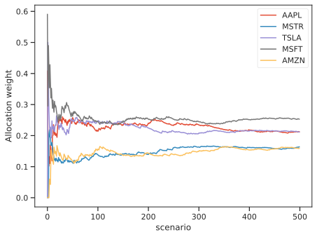

# Ensemble methods

This class of meta-estimators are based on the idea that building a robust portfolio requires great attention to 
**estimation risk**. 
Estimation risk is the risk that inputs to the portfolio optimization process (i.e., expected returns and 
volatilities or correlations) are inaccurately estimated by sampling from historical data, leading to suboptimal allocations.

It is known that in the mean-variance portoflio, even small inaccuracies in the estimation of expected 
returns from prices, leads to very large errors in the optimal allocation, thus producing portfolios with skewed 
allocations. As a consequence of the fact that more uniform portfolios typically lead to greater out-of-sample 
performances, this behaviour is unwanted, and could be reminiscent of the overfitting phenomenon in machine learning. 

In this section we collect some methods and address the *reduce portfolio overfitting* problem, with a multitude of 
different approaches, borrowing ideas from machine-learning (regularization) and classical statistics (bootstrapping)
and bayesian statistics. 

## 1. Resampled efficient frontier
The classical approach to asset allocation is a two-step process: first the market distribution is estimated, then an optimization is performed, as if the estimated distribution were the true market distribution. 
Since this is not the case, the classical *optimal* allocation is not truly optimal.
More importantly, since the optimization process is extremely sensitive to the input parameters, the sub-optimality due to estimation risk can be **dramatic**.

Monte Carlo resampling methods are used to model more realistic investment input parameters for the portfolio optimization.

The **Resampled Efficient Frontier** method [^2]  avoids the literal use of the estimated distribution of 
market invariants (returns), but rather seeks to *+average** a randomly perturbed scenario over a large number of 
possible investment histories.

The idea is very simple and is reminiscent of the **bootstraping technique** in statistics.
Because of our limited ability to calculate the *real* estimates of risk and returns, we **bootstrap** on 
historical returns by performing  **random normal perturbations**, sampling from $\tilde{\boldsymbol{\mu}} \sim N(\hat{\boldsymbol \mu}, \hat{\mathbf{C}}
)$, where $\hat{\boldsymbol \mu}$ are the sample mean of historical returns, and $\hat{\mathbf{C}}$ is the sample 
covariance of historical returns, thus producing a number of $K$ Monte-Carlo scenarios.

Each of the $K$ random scenario can be thought as a possible case, as the expected returns are compatible with the 
observed returns series, provided that the sample covariance is big enough to allow some *wiggling* of the averages around their true but unobservable values.

Under very reasonable assumptions, the resampled frontier method is provably effective at improving risk-adjusted portfolio return on out-of-sample data.
Such a portfolio is different from the Markowitz efficient portfolio it will have suboptimal risk/return characteristics
with respect to the sample mean and covariance, but optimal characteristics when averaged over the many possible values 
of the unknown true mean and covariance.


We then solve for the efficient frontier over each perturbed sample and average all the solutions to get a more robust portfolio, without all those extreme allocations, typical of Markowitz-like 
optimization. 
Resampled optimized portfolios perform better because they are better risk-managed by avoiding the unrealistical literal use of investment information that characterizes Markowitz Mean-Variance optimization.

**`scikit-portfolio`** extends the advantages of the resampled frontier approach to virtually all portfolio 
estimators whose one input parameter is a `rets_estimator` of type `BaseReturnsEstimator` , not only to the [classical 
portfolios](efficient_frontier.md) such as the `MinimumVolatility` portfolio or the `MaxSharpe`, discussed in the 
classical efficient frontier approach.

You can simply create a standard `MichaudEfficientFrontier` portfolio in **`scikit-portfolio`** by importing both 
the `MichaudEfficientFrontier` object and the desidered portfolio estimator. Here we produce an ensemble estimate of 
the `MaxSharpeRatio` portfolio, a method that is known to produce highly skewed allocations because of the strong 
sensitivity on expected returns.

```python
import pandas as pd
from skportfolio.ensemble import MichaudResampledFrontier
from skportfolio.frontier import MaxSharpe
from skportfolio import SampleCovariance,MeanHistoricalLinearReturns
from skportfolio.datasets import load_tech_stock_prices

prices = load_tech_stock_prices()
# create a Maximum sharpe ratio portfolio estimator to be fed to resampled frontier meta-estimator
ptf = MaxSharpe(
	returns_data=False,
	risk_free_rate=0.0,
	frequency=252,
	rets_estimator=MeanHistoricalLinearReturns()
)
ensemble = MichaudResampledFrontier(
	ptf_estimator=ptf,
	rets_estimator=MeanHistoricalLinearReturns(), 
    risk_estimator=SampleCovariance(),
	n_iter=512,
	n_jobs=-1
).fit(prices)

W = pd.concat(ensemble.all_weights_, axis=1)
W.T.expanding().mean().plot()
```

Here we show the cumulative average of asset weights under the resampled frontier allocation. It is evident that 
after enough scenarios, the weights averages tend to stabilize around the correct values for the optimal 
maximum sharpe ratio allocation.

!!! note
	
	
	**Figure 1.** The asset allocation under resampling of expected returns, results much more uniform than the extremal pointwise allocations from the maximum sharpe portfolios.

We could stop here, but we want to show how to use the Resampled Frontier portfolio also to estimate Maximum Omega 
Ratio portfolios, to reduce the estimation error.

```python
import pandas as pd
from skportfolio.ensemble import MichaudResampledFrontier
from skportfolio.frontier import MaxOmegaRatio
from skportfolio import SampleCovariance,MeanHistoricalLinearReturns

from skportfolio.datasets import load_tech_stock_prices

prices = load_tech_stock_prices()
returns = prices.pct_change().dropna()
# create a Maximum sharpe ratio portfolio estimator to be fed to resampled frontier meta-estimator
ptf = MaxOmegaRatio(
    returns_data=False,
    frequency=252
)

ensemble = MichaudResampledFrontier(
    ptf_estimator=ptf,
    rets_estimator=MeanHistoricalLinearReturns(),
    risk_estimator=SampleCovariance(),
    n_iter=512,
    n_jobs=-1
).fit(prices)

## Plotting part
import matplotlib.pyplot as plt

W = pd.concat(ensemble.all_weights_, axis=1).T
fig, ax = plt.subplots(figsize=(12, 7))
W.plot(ax=ax)
ax.set_xlabel('scenario')
ax.set_ylabel('Cumulative average weight')
```

The allocation weights are slightly different with the Omega ratio efficient frontier, but nonetheless we still 
observe a tendency to stabilization of portfolio weights when considering the cumulative average. The optimal number 
of scenarios should be chosen in a way such that the cumulative averages are self-stabilizing. The default value of 
500 scenarios is a good trade-off in most cases.

!!! note
	
	
	**Figure 2.** Average weights allocation for the Maximum Omega Ratio portfolio, as a function of the scenario index. 

## 2. Subset Resampling
Here we implement an enhanced version of the **subset resampling technique** discussed in the paper: 

> "Portfolio Selection via Subset Resampling" [^3]

The technique works by averaging allocation estimated with a noise-sensitive portfolio estimator (such as `MaxSharpeRatio`) over many *masked* subsets of assets. 
The mask-optimization process is repeated many times: every iteration considers only a certain fraction of the entire asset universe, and optimal weights are computed.
All the local estimates are then aggregated either by averaging or by voting mechanism, and a final allocation is 
produced.

This method is very similar to the well-known class of ensemble methods in machine learning, for example [RandomForests](https://scikit-learn.org/stable/modules/generated/sklearn.ensemble.RandomForestRegressor.html) 
where many **weak learners** are merged to produce a robust estimation. 
In this way the risk of parameters estimation is reduced, and outlier effects are smoothed away in the final estimate.

Being controlled by a single parameter selecting the fraction of assets to be sampled at each itereation, we can see 
the two ends of the spectrum of possible sub-estimators produced by `SubsetResampling` meta-estimator.
On one side, with sampling one single asset at every step (hence fraction=`1/N`, we asymptotically obtain the same 
results as from the `EquallyWeighted` portfolio. On the other side, sampling with `fraction=1` we simply return the 
results from the input portfolio estimator. In other words the fraction of assets to be selected at each iteration 
controls a smooth blending between the equally weighted portfolio and the single portfolio estimator.

In the following code snippet we illustrate how to use the estimator `SubsetResampling` jointly with 
`MaxSharpeRatio` on the technological stocks example. We average 64 estimates of random subsets of the stocks from 
the `prices` dataset. By setting the `subset_size=0.5` we implement what suggested by the original authors and pick 
on each iteration a number of columns equivalent to $5^{0.5}$ (with integer approximation). While does not make much 
sense for our data, as we only have 5 stocks in the data, it illustrates well the point.

```python
from skportfolio.frontier import MaxSharpe
from skportfolio.ensemble import SubsetResampling
from skportfolio.datasets import load_tech_stock_prices

prices = load_tech_stock_prices()
# fit on price data and average over 64 estimates, 
# considering ceil(5**0.5) = 3 stocks per subsample
ptf = SubsetResampling(
    ptf_estimator=MaxSharpe(),
    subset_size=0.5,
    n_iter=64,
    n_jobs=-1,
    agg_func="median"
).fit(prices)

ptf.weights_
```

One can also access the list of weights in the `ptf.all_weights_` variable, which in this case is a $64 \times 5$ array 
containing all  weights, in order to create nice visualizations.

Here is a picture of a 2D embedding of all portfolio weights using the dimensionality reduction method [UMAP](https://umap-learn.readthedocs.io/en/latest/plotting.html) from data related to cryptocurrencies prices over 2 years, for a total of more than 200 assets.


!!! note
	
	
	**Figure 3.** Dimensionality reduction of portfolio weights as estimate from subset resampling.
	Point color is the Sharpe ratio of the portfolio returns, darker points corresponds to higher Sharpe Ratios. 
	The average weights are depicted with a red dot, while median weights are indicated with the purple dot. 
	Median weights portfolio tends to stay in sparser areas: 

For further description and ideas [visit here](https://blog.thinknewfound.com/2018/07/machine-learning-subset-resampling-and-portfolio-optimization/)

## 3. Bayesian Robust Allocation
Among the just discussed methods, the Bayesian Robust allocation is by far the most complex. It is based on a 
variant of the Black-Litterman model, designed by Attilio Meucci.

Bayesian theory provides a way to limit the sensitivity of the final allocation to the input parameters by shrinking the estimate of the market parameters
toward the investor’s prior, as in the Black-Litterman approach.
At the same time, the theory of robust optimization provides a different approach to dealing with estimation risk: the investor chooses the best allocation in the worst market
within a given uncertainty range.
Robust allocations are guaranteed to perform adequately for all the markets within the given uncertainty range. Nevertheless, the choice of this range is
quite arbitrary. Furthermore, the investor’s prior knowledge, a key ingredient in any allocation decision, is not taken in consideration.

Using the Bayesian approach to estimation we can naturally identify a suitable uncertainty range for the market parameters, namely the location-dispersion ellipsoid of their posterior distribution.
Robust Bayesian allocations are the solutions to a robust optimization problem that uses as uncertainty range the Bayesian location-dispersion ellipsoid. Similarly to robust allocations, these al-
locations account for estimation risk over a whole range of market parameters. 

Similarly to Bayesian decisions, these allocations include the investor’s prior knowledge in the optimization process within a sound and self-adjusting statistical framework.

Here we consider robust Bayesian decisions that also account for the estimation error in the covariances and that, unlike in the Black-Litterman framework, explicitly process the information from the market, namely the observed time series of the past returns.
As it turns out, the multi-parameter, non-conically constrained mean-variance optimization simplifies to a parsimonious Bayesian efficient frontier that resembles the classical frontier, except that
the classical parameterization in terms of the exposure to market risk becomes in this context a parameterization in terms of the exposure to both market risk and estimation risk.


```python
from skportfolio.ensemble import RobustBayesian
from skportfolio import MeanHistoricalLinearReturns,SampleCovariance
RobustBayesian(
	window=180,
	rets_estimator=MeanHistoricalLinearReturns(),
	risk_estimator=SampleCovariance(),
	n_portfolios=16,
	robustness_param_loc=0.1,
	robustness_param_scatter=0.1,
	n_jobs=-1
)
```

# References
[^2]: *Efficient Asset Management: A practical Guide to Stock Portfolio Optimization and Asset Allocation.*, Michaud,
R., and Michaud, R. (1998) ISBN 978-0-19-533191-2.
[^3]: "Portfolio Selection via Subset Resampling", Shen and Wang (2017) [https://aaai.org/ocs/index.
php/AAAI/AAAI17/paper/download/14443/13945](https://aaai.org/ocs/index.php/AAAI/AAAI17/paper/download/14443/13945)
